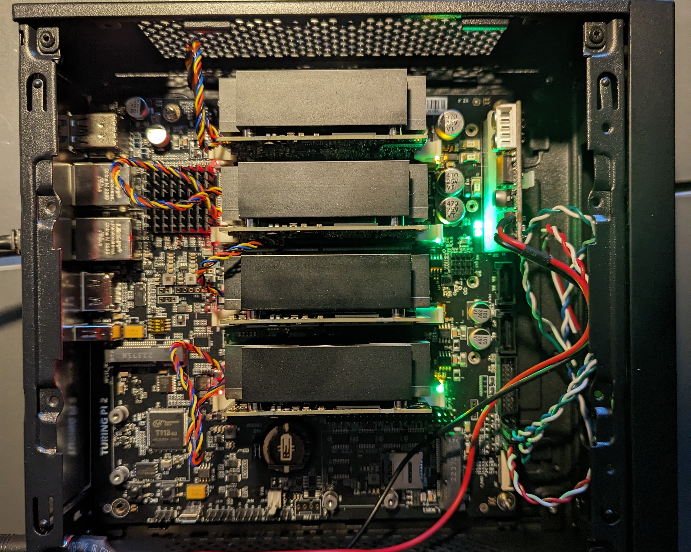

# Turing Pi v2 K3S Cluster with RK 1 Compute Modules (Project is WIP and not finished!)
This project uses an Ansible playbook to install a K3S 4 node cluster on the RK1 computer modules from the [Turing Pi Project](https://turingpi.com/).
This involves installing 3 servers and 1 agent node.

After the successful K3S installation, Argo CD is installed and linked to this repository using the [App of Apps pattern (cluster bootstrapping)](https://argo-cd.readthedocs.io/en/stable/operator-manual/cluster-bootstrapping/).
This simplifies the handling of the various Helm charts, their configurations and updates.

# Install
## Prerequisites
* The RK1 Ubuntu server image must be flashed to the modules as described in the [Turing Pi Docs - Flashing OS](https://docs.turingpi.com/docs/turing-rk1-flashing-os).
* Passwordless authentication via SSH key must be set up on all nodes.

## Setup K3S on RK1
Copy the hosts-sample.yml and adjust the settings like ip addresses of the RK1 Modules. Afterward run the Ansible playbook
```bash
cp hosts-sample.yml hosts.yml
# adjust the ip addresses and nvme settings
# and run the playbook
ansible-playbook -i hosts.yml turingpi.yml
```
After successful provisioning, all nodes should be available.
```
$ ssh ubuntu@ip-of-rk1-module
$ kubectl get nodes -o wide
NAME        STATUS   ROLES                       AGE   VERSION        INTERNAL-IP       EXTERNAL-IP   OS-IMAGE             KERNEL-VERSION      CONTAINER-RUNTIME
turing-01   Ready    control-plane,etcd,master   23h   v1.28.6+k3s2   192.168.100.231   <none>        Ubuntu 22.04.4 LTS   5.10.160-rockchip   containerd://1.7.11-k3s2
turing-02   Ready    control-plane,etcd,master   23h   v1.28.6+k3s2   192.168.100.232   <none>        Ubuntu 22.04.4 LTS   5.10.160-rockchip   containerd://1.7.11-k3s2
turing-03   Ready    control-plane,etcd,master   23h   v1.28.6+k3s2   192.168.100.233   <none>        Ubuntu 22.04.4 LTS   5.10.160-rockchip   containerd://1.7.11-k3s2
turing-04   Ready    <none>                      23h   v1.28.6+k3s2   192.168.100.234   <none>        Ubuntu 22.04.4 LTS   5.10.160-rockchip   containerd://1.7.11-k3s2
```
## Accessing the Cluster

### kubectl
So that we do not always have to connect to the RK1 modules to execute `kubectl` commands, we can copy the `kubeconfig` to the local machine.
Afterwards we have to change the cluster IP address in the `kubeconfig`.

```
scp ubuntu@ip-of-rk1-module:~/.kube/config .kubeconfig
```

Open the `kubeconfig` with a text editor of your choice and replace the IP address of the cluster.
```
- cluster:
    certificate-authority-data: ... snip ...
    server: https://127.0.0.1:6443 # <- change this address to one of the control-plane nodes addresses from your hosts.yaml. e.g. https://192.168.100.231:6443
  name: default
```

Test the connection to the cluster from your local machine
```
$ kubectl --kubeconfig ./kubeconfig get nodes -o wide
NAME        STATUS   ROLES                       AGE   VERSION        INTERNAL-IP       EXTERNAL-IP   OS-IMAGE             KERNEL-VERSION      CONTAINER-RUNTIME
turing-01   Ready    control-plane,etcd,master   23h   v1.28.6+k3s2   192.168.100.231   <none>        Ubuntu 22.04.4 LTS   5.10.160-rockchip   containerd://1.7.11-k3s2
turing-02   Ready    control-plane,etcd,master   23h   v1.28.6+k3s2   192.168.100.232   <none>        Ubuntu 22.04.4 LTS   5.10.160-rockchip   containerd://1.7.11-k3s2
turing-03   Ready    control-plane,etcd,master   23h   v1.28.6+k3s2   192.168.100.233   <none>        Ubuntu 22.04.4 LTS   5.10.160-rockchip   containerd://1.7.11-k3s2
turing-04   Ready    <none>                      23h   v1.28.6+k3s2   192.168.100.234   <none>        Ubuntu 22.04.4 LTS   5.10.160-rockchip   containerd://1.7.11-k3s2
```
To avoid having to specify the path to your Kubeconfig each time using the `--kubeconfig` option, it can also be copied
to the location `~/.kube/config`. By default, `kubectl` searches for a configuration there, if none has been specified.

### Argo CD
Argo CD creates a random password each time it is installed. Before you can connect to the web/cli interface, this must be determined.
``` 
$ kubectl --kubeconfig ./kubeconfig --namespace argo-cd get secrets argocd-initial-admin-secret -o jsonpath='{.data.password}' | base64 -d
blcElfzg7sQ-i8e7 # <- admin password
```
Now a tunnel to Argo CD on port 8080 can be established and used via port-forward
```
$ kubectl --kubeconfig ./kubeconfig port-forward --namespace argo-cd services/argo-cd-argocd-server 8080:80
```
You should now be able to connect with the browser to [http://localhost:8080](http://localhost:8080) and sign in to the Web UI with the username `admin`
and the password determined from the secret.


---


