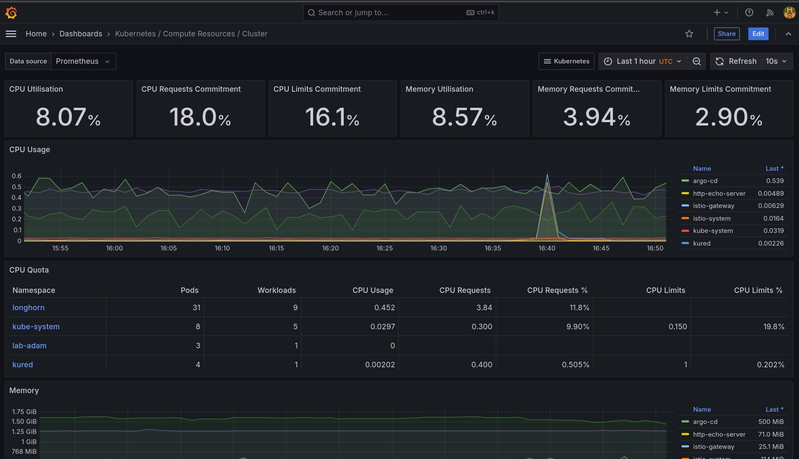
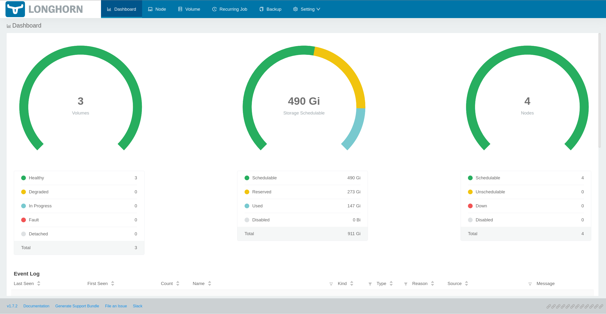

# Turing Pi v2 K3S Cluster with RK 1 Compute Modules (Project is WIP and not finished!)
This project uses an Ansible playbook to install a K3S 4 node cluster on the RK1 computer modules from the [Turing Pi Project](https://turingpi.com/).
This involves installing 3 servers and 1 agent node.

After the successful K3S installation, Argo CD is installed and linked to this repository using the [App of Apps pattern (cluster bootstrapping)](https://argo-cd.readthedocs.io/en/stable/operator-manual/cluster-bootstrapping/).
This simplifies the handling of the various Helm charts, their configurations and updates.

Includes tools and operators
- [Argo CD](https://github.com/argoproj/argo-helm/tree/main/charts/argo-cd)
- [Prometheus Kube Stack](https://github.com/prometheus-community/helm-charts/tree/main/charts/kube-prometheus-stack)
- [Longhorn CSI](https://github.com/longhorn/longhorn)
- [Istio & Gateway](https://github.com/istio/istio/tree/master/manifests/charts)
- [http echo server](https://github.com/mendhak/docker-http-https-echo)
- [K3S System Upgrade Controller](https://github.com/rancher/system-upgrade-controller/tree/master/manifests)
- [Jaeger Tracing](https://github.com/jaegertracing/helm-charts)
- [Kiali](https://github.com/kiali/helm-charts/tree/master/kiali-server)
- [Bitnami Sealed Secrets](https://github.com/bitnami/charts/tree/main/bitnami/sealed-secrets)
- [Kured](https://github.com/kubereboot/kured)
- [Cert Manager](https://github.com/cert-manager/cert-manager)

# Install
## Prerequisites
* The RK1 Ubuntu server image must be flashed to the modules as described in the [Turing Pi Docs - Flashing OS](https://docs.turingpi.com/docs/turing-rk1-flashing-os).
* Passwordless authentication via SSH key must be set up on all nodes.

## Setup K3S on RK1
Copy the hosts-sample.yml and adjust the settings like ip addresses of the RK1 Modules. Afterward run the Ansible playbook
```bash
cp hosts-sample.yml hosts.yml
# adjust the ip addresses and nvme settings
# and run the playbook
ansible-playbook -i hosts.yml turingpi.yml
```
After successful provisioning, all nodes should be available.
```
$ ssh ubuntu@ip-of-rk1-module
$ kubectl get nodes -o wide
NAME        STATUS   ROLES                       AGE   VERSION        INTERNAL-IP       EXTERNAL-IP   OS-IMAGE             KERNEL-VERSION      CONTAINER-RUNTIME
turing-01   Ready    control-plane,etcd,master   23h   v1.28.6+k3s2   192.168.100.231   <none>        Ubuntu 22.04.4 LTS   5.10.160-rockchip   containerd://1.7.11-k3s2
turing-02   Ready    control-plane,etcd,master   23h   v1.28.6+k3s2   192.168.100.232   <none>        Ubuntu 22.04.4 LTS   5.10.160-rockchip   containerd://1.7.11-k3s2
turing-03   Ready    control-plane,etcd,master   23h   v1.28.6+k3s2   192.168.100.233   <none>        Ubuntu 22.04.4 LTS   5.10.160-rockchip   containerd://1.7.11-k3s2
turing-04   Ready    <none>                      23h   v1.28.6+k3s2   192.168.100.234   <none>        Ubuntu 22.04.4 LTS   5.10.160-rockchip   containerd://1.7.11-k3s2
```
## Accessing the Cluster

### kubectl
So that we do not always have to connect to the RK1 modules to execute `kubectl` commands, we can copy the `kubeconfig` to the local machine.
Afterwards we have to change the cluster IP address in the `kubeconfig`.

```
scp ubuntu@ip-of-rk1-module:~/.kube/config .kubeconfig
```

Open the `kubeconfig` with a text editor of your choice and replace the IP address of the cluster.
```
- cluster:
    certificate-authority-data: ... snip ...
    server: https://127.0.0.1:6443 # <- change this address to one of the control-plane nodes addresses from your hosts.yaml. e.g. https://192.168.100.231:6443
  name: default
```

Test the connection to the cluster from your local machine
```
$ kubectl --kubeconfig ./kubeconfig get nodes -o wide
NAME        STATUS   ROLES                       AGE   VERSION        INTERNAL-IP       EXTERNAL-IP   OS-IMAGE             KERNEL-VERSION      CONTAINER-RUNTIME
turing-01   Ready    control-plane,etcd,master   23h   v1.28.6+k3s2   192.168.100.231   <none>        Ubuntu 22.04.4 LTS   5.10.160-rockchip   containerd://1.7.11-k3s2
turing-02   Ready    control-plane,etcd,master   23h   v1.28.6+k3s2   192.168.100.232   <none>        Ubuntu 22.04.4 LTS   5.10.160-rockchip   containerd://1.7.11-k3s2
turing-03   Ready    control-plane,etcd,master   23h   v1.28.6+k3s2   192.168.100.233   <none>        Ubuntu 22.04.4 LTS   5.10.160-rockchip   containerd://1.7.11-k3s2
turing-04   Ready    <none>                      23h   v1.28.6+k3s2   192.168.100.234   <none>        Ubuntu 22.04.4 LTS   5.10.160-rockchip   containerd://1.7.11-k3s2
```
To avoid having to specify the path to your Kubeconfig each time using the `--kubeconfig` option, it can also be copied
to the location `~/.kube/config`. By default, `kubectl` searches for a configuration there, if none has been specified.

### Browser
```
http://<ip-of-a-node>/grafana
http://<ip-of-a-node>/kiali
http://<ip-of-a-node>/argocd
http://<ip-of-a-node>/jaeger
```

### Kiali Sign in
Kiali Sign in tokens have a short lifetime. Therefore, a new token must be created each time the Kiali Dashboard is needed
```
$ kubectl --namespace istio-system create token kiali                                                                                                                         

eyJhbGciOiJSUzI1NiIsImtVbt_-7...snip...-aWjp3925QexVkfQuPP-qQ94AtoZGS2LQwvz7KcKKEVLUtfbKZeFie3B6EQO4iQ
```

### Argo CD
Argo CD creates a random password each time it is installed. Before you can connect to the web/cli interface, this must be determined.
``` 
$ kubectl --kubeconfig ./kubeconfig --namespace argo-cd get secrets argocd-initial-admin-secret -o jsonpath='{.data.password}' | base64 -d
blcElfzg7sQ-i8e7 # <- admin password
```

You should now be able to sign in to the Admin UI with the user name `admin`
and the password determined from the secret.

If you prefer to use the terminal, you can log in with the argocd cli tool using the following command
```
$ argocd login <ip-of-a-node>:80 --grpc-web-root-path argocd
```

### Grafana
In the Prometheus Kube stack, the credentials have not been changed and are default. You can log in to the dashboard 
using the username `admin` and password `prom-operator`.


### Longhorn CSI
The Longhorn Web UI is not exposed at all via Ingress or Istio Gateway. If access to the dashboard is required, a port
forward to localhost should be established via kubectl. The dashboard can then be accessed at http://localhost:8080
```
$ kubectl --kubeconfig ./kubeconfig -n longhorn port-forward svc/longhorn-frontend 8080:80
```


### Bitnami Sealed Secrets
Sealed Secrets are used to create encrypted Kubernetes Secrets. Before such a secret can be created, the
public certificate must be exported from the controller
```
$ kubeseal --kubeconfig ./kubeconfig --namespace kube-system  --controller-name sealed-secrets --fetch-cert > public-key-cert.pem
```
After the public certificate has been successfully obtained, Kubernetes Secrets can be encrypted.

#### Create a secret
```
echo "
apiVersion: v1
kind: Secret
metadata:
  name: mysecret
type: Opaque
stringData:
  password: 'v3rySekur'" > secret.yaml
```
#### Encrypt it
```
$ kubeseal --kubeconfig ./kubeconfig  --scope cluster-wide --namespace kube-system  --controller-name sealed-secrets --format=yaml --cert=public-key-cert.pem  < secret.yaml > secret-sealed.yaml
``` 
#### expected output
```
cat secret-sealed.yaml
---
apiVersion: bitnami.com/v1alpha1
kind: SealedSecret
metadata:
  annotations:
    sealedsecrets.bitnami.com/cluster-wide: "true"
  creationTimestamp: null
  name: mysecret
spec:
  encryptedData:
    password: AgAiB0sFG+kBfqvR5NWfmsqbHrt2uvZMeGx3DlopOWHJjeZ3WhukBNGbAb3IdBISFXdxiprnudBk1dvP3DPKdCcvqisq8kfE2+NzNOMn40/J9JtSopIJBLF3rK3cVUhXDL2bXvDEwChKsLQyi0gOw7bqObSU3t86O1a2/XK8+iyTnJh/p6oKo6rtGNTMOUOVxYoGwfcvV+yoXEqovO2MWfgi2N9SEPIwzPmDiDXo+Tbfue2EQY4qSAyK8UoddzjMec07EDod3tLfJBT+lJ8BhAHJQJvYIC7UD6izUAi4rvZ/iLaDvt7DsPyhGVD3IT3aH48zkrg7uDxJVeVMYQyJvxLTdcQPfMYUB0eKKlL0MZioGU5jM0aoTLVFh2iZDF4d65bTEszG+NfF4lGq3pjAtA2zlJTFmdUXfoLy1fWqvFPo4TvdjEK2uBXWr2TjyvGMONOZjzoJ+GfGytLVVn4+ZIJofKDmQxogy8Tcdv5HvEahJwoy5pVRrHH8qdCFFk+hVLCdDUxP784XiQcCtCqR1A9Rb9oZhtG5CIRYqxmgEqo/aamSIwCPPjFEoEUaCyojmBGU7CTL3mjFBkEYHNu8vP37xAPCcV/X+EAVN4PpPgQwAlkGIUGv1Y9/XC5qERVaYrcBHquMHKYCYHrKeYuAlYrG8qpDG7gvXTIYjWpvZW76EpeCImouzbKP4yAdXqyh730ZBhYOgaBJfkg=
  template:
    metadata:
      annotations:
        sealedsecrets.bitnami.com/cluster-wide: "true"
      creationTimestamp: null
      name: mysecret
    type: Opaque

```
#### Bring your own certificates
It is also possible to create your own certificates and use them to encrypt secrets, the procedure is [explained here](https://github.com/bitnami-labs/sealed-secrets/blob/main/docs/bring-your-own-certificates.md).

---


